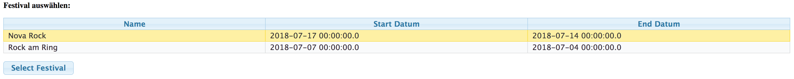
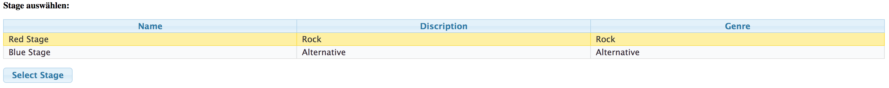
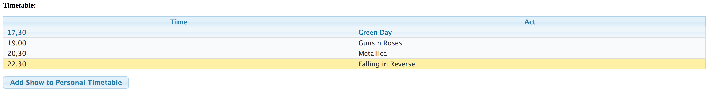
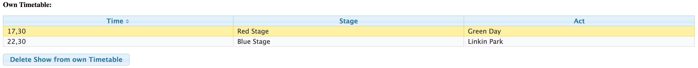

<h1>Festival Manager Microprojekt</h1>
Der Festivalmanager ermöglicht es für ein zu besuchendes Festival seinen eigenen Timetable zu erstellen wo man angeben kann welche Bands man sehen möchte damit man eine bessere Übersicht über seinen Tagesablauf hat und keine seiner Lieblingsbands mehr versäumt.

Zu allererst kann ein Musik-Festival ausgewählt werden welches besucht wird.

Danach kann eine Stage ausgewählt werden welche man gerne Besuchen möchte

Hat man diese Stage nun ausgewählt bekommt man den dazugehörigen Timetable für diese Stage aus diesem Timetable kann man nun einige für einen selbst relevanten Auftritte von Künstlern seinem eigenen Timetable hinzufügen.

Nun sieht man den einigen Timetable sollte man bei diesem fälschlicherweise eine Band oder einen Musiker hinzugefügt haben welcher einen doch nicht interessiert kann man diesen ganz einfach wieder entfernen.